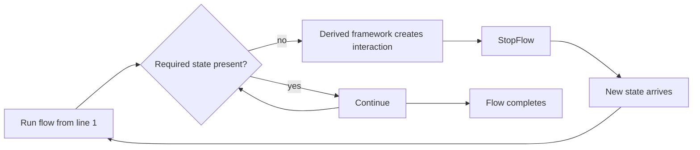

<div align="center">

# Recause

### WORK IN PROGRESS - FILES COMING SHORTLY (TODAY IS July 11 2026)

### There is another way to write interactive software.

Write a normal flow.  
Stop when information is missing.  
Re-run when new state arrives.

[Website](https://recause.org) · [Live demonstration](https://recause.org/#demo)

</div>

---

Recause is an experimental programming model and reference implementation for **incremental, resumable interaction flows**.

A Recause flow is written as ordinary JavaScript. The runtime evaluates that function against explicit state. When a derived framework reaches information that is not yet available, it presents the appropriate interaction and stops the flow. When the missing state becomes available, the same function runs again from the beginning.

Earlier operations resolve immediately from state. Execution reaches the next unsatisfied point.

```text
RUN → STOP → STATE → RUN
```

The result is code that often reads like the interaction itself, without splitting the domain flow across event handlers, callbacks, component lifecycles, workflow nodes, and explicit resume logic.

> Recause does not preserve a suspended JavaScript call stack.  
> Progress is represented by serializable state.

## The idea in one example

A small chat-style flow can be written as one function:

```js
function registrationFlow(chat) {
  chat.say("Welcome.");

  chat.askText("What should we call you?", "name");

  chat.askRadio("What are you building?", "goal", [
    { value: "form", label: "A form" },
    { value: "chat", label: "A guided chat" },
    { value: "flow", label: "A larger interaction flow" }
  ]);

  const name = chat.getValue("name");
  const goal = chat.getValue("goal");

  chat.say(`Hello ${name}. Let us shape your ${goal}.`);
}
```

Run it with a `ChatWizard`:

```js
const container = document.getElementById("app");

const wizard = new ChatWizard(
  container,
  null,
  registrationFlow
);

wizard.runFlow();
```

On the first run, `name` is missing:

```text
registrationFlow()
  say("Welcome.")                 ✓
  askText("...", "name")          STOP
```

The user answers. The value is written to state. The same function runs again:

```text
registrationFlow()
  say("Welcome.")                 ✓
  askText("...", "name")          ✓  resolved from state
  askRadio("...", "goal")         STOP
```

After the second answer, the flow runs again and reaches its end:

```text
registrationFlow()
  say("Welcome.")                 ✓
  askText("...", "name")          ✓
  askRadio("...", "goal")         ✓
  say("Hello …")                  ✓
```

No continuation object is authored. No transition table says where to resume. The accumulated state causes more of the same program to become executable.

## What Recause actually does

At the engine level, the model is deliberately small:

1. Evaluate a flow function.
2. Let the flow read explicit state.
3. Stop when required state is missing.
4. Acquire or produce that state.
5. Evaluate the flow again.
6. Continue until the flow completes.

In the reference implementation, intentional suspension and re-entry are represented by two control signals:

```js
throw new StopFlow();
throw new RestartFlow();
```

These are expected runtime control signals, not application failures.

The application flow normally does not catch them. The Recause engine does.



## State is the continuation

Recause keeps relevant progress in one hierarchical, JSON-friendly state structure.

That state can include:

- answers;
- page position;
- nested collection items;
- completion markers;
- data returned by asynchronous work;
- interaction-specific metadata;
- optional history.

Because progress is explicit, a flow can be serialized while incomplete and reconstructed later.

```js
const serialized = wizard.recauseEngine.getStateAsJSON();
```

A new engine can be created from restored state and the same flow definition:

```js
const restoredState = JSON.parse(serialized);

const restoredWizard = new ChatWizard(
  document.getElementById("app"),
  restoredState,
  registrationFlow
);

restoredWizard.runFlow();
```

The state is not literally an instruction pointer. It plays a similar role by allowing already-satisfied operations to resolve and guiding execution toward the next missing fact.

## Recause is a metaframework

The engine is unlikely to be the API most applications use directly.

Its purpose is to support **derived frameworks** that interpret missing state in domain-specific ways.

The repository currently demonstrates several such interaction frameworks:

| Framework | Interpretation of missing state |
|---|---|
| `FormWizard` | Render a form field or form section |
| `ChatWizard` | Ask the next question conversationally |
| `PagesWizard` | Organize nested flows into navigable pages |
| `AsyncWizard` | Wait for data or work to complete |

A derived framework decides:

- how a request for state is expressed;
- how the interaction is rendered or performed;
- whether it blocks the parent flow;
- where the answer is stored;
- when the flow should run again.

Recause provides the shared execution and state model underneath.

## Composition

The interaction styles are not separate applications. They can be nested while operating on one scoped state tree.

```js
function groupTripFlow(pages) {
  const travelerIds =
    pages.getValue("/onboarding.travelers") || [];

  pages.beginPage("01 / Group");

  pages.askForm("onboarding", form => {
    form.askText("Destination", "destination", {
      required: true,
      errorMsg: "A destination is required"
    });

    form.askList("Travelers", "travelers", item => {
      item.askText("Traveler name", "name", {
        required: true
      });
    });

    form.chat("packingHelp", "assistant", false, chat => {
      chat.say("I can help with difficult packing decisions.");

      chat.askButton("Would you like assistance?", "enabled", [
        { value: "yes", label: "Yes" },
        { value: "no", label: "No" }
      ]);

      if (chat.getValue("enabled") === "yes") {
        chat.askText("What kind of trip is this?", "tripStyle");
      }
    });

    form.submitButton("Continue", "complete");
  });

  pages.endPage();

  pages.beginPage("02 / Review");

  pages.say(
    `Destination: **${
      pages.getValue("/onboarding.destination") || "—"
    }**`
  );

  pages.endPage();
}
```

Here:

- `PagesWizard` controls the outer navigation;
- a `FormWizard` collects related values;
- a `ChatWizard` is embedded only where guided interaction helps;
- each nested framework receives a scoped view of the same state;
- the concrete domain flow remains ordinary JavaScript.

This is the main reason Recause is described as a metaframework rather than a form library.

## Scoped state

Nested frameworks use relative paths.

Inside the `onboarding` form:

```js
form.askText("Destination", "destination");
```

stores a value below that form's scope.

From the outer page flow, the same value can be addressed absolutely:

```js
pages.getValue("/onboarding.destination");
```

A leading `/` addresses the root. Relative paths stay within the current scope.

This lets reusable interaction frameworks operate without knowing where they are mounted in the larger application.

## Re-evaluation, not continuation capture

Recause does **not**:

- retain the original JavaScript stack;
- transform the flow into a generator;
- compile the function into a state machine;
- persist closures;
- jump back into the middle of a suspended function.

Instead, it relies on re-evaluation.

That has an important consequence:

> A flow may execute many times.

Flow code should therefore be treated as a projection of current state. Pure calculations are naturally safe. External side effects require explicit care.

Good:

```js
const total = items.reduce(
  (sum, item) => sum + item.cost,
  0
);
```

Dangerous:

```js
sendInvoice(); // could run again on every re-evaluation
```

External effects should be guarded by explicit state, idempotency keys, or a dedicated effect abstraction:

```js
if (!flow.getValue("invoice.sent")) {
  // perform an idempotent effect
  // then record its confirmed result
}
```

The current project is a reference implementation. A more formal effect model is an important future direction.

## History, undo, and redo

A root engine can record state history:

```js
const wizard = new PagesWizard(
  container,
  null,
  applicationFlow,
  null,
  { recordHistory: true }
);
```

The engine exposes:

```js
wizard.recauseEngine.canUndo();
wizard.recauseEngine.canRedo();
wizard.recauseEngine.undo();
wizard.recauseEngine.redo();
```

After restoring a previous state, the flow is evaluated again and the appropriate interaction is derived from that state.

Undo is therefore not implemented separately by every control.

## Revision-aware state

State nodes carry revision information. The engine exposes helpers including:

```js
flow.revisionValue("path.to.value");
flow.ageValue("path.to.value");
flow.forceValueOrder("older.path", "newer.path");
```

These allow a flow or derived framework to reason about which facts are newer and invalidate dependent state when earlier facts change.

This is useful when a later answer is only valid under an earlier choice.

## Quick start

The current reference implementation is plain JavaScript and can be loaded directly in a browser.

```html
<!doctype html>
<html lang="en">
<head>
  <meta charset="utf-8">
  <title>Recause example</title>
</head>
<body>
  <main id="app"></main>

  <script src="recauseEngine.js"></script>
  <script src="asyncWizard.js"></script>
  <script src="baseWizard.js"></script>
  <script src="formWizard.js"></script>
  <script src="chatWizard.js"></script>
  <script src="pagesWizard.js"></script>

  <script>
    function flow(chat) {
      chat.say("Hello.");
      chat.askText("Your name?", "name");
      chat.say(`Welcome, ${chat.getValue("name")}.`);
    }

    const wizard = new ChatWizard(
      document.getElementById("app"),
      null,
      flow
    );

    wizard.runFlow();
  </script>
</body>
</html>
```

The sample UI frameworks render directly to the DOM, so their stylesheet must also be included when using the repository's supplied presentation.

The engine and several classes also expose CommonJS exports, but the current UI framework implementations are browser-oriented.

## Repository map

The exact organization may evolve, but the central pieces are:

```text
recauseEngine.js   state, scoping, history, StopFlow, RestartFlow
baseWizard.js      shared runtime and nesting behavior for UI frameworks
formWizard.js      form-style interaction framework
chatWizard.js      sequential conversational interaction framework
pagesWizard.js     navigable page composition
asyncWizard.js     asynchronous data interaction
premiumDemo.html   composed multi-page demonstration
```

## Selected APIs

### Engine state API

Available directly or through framework flow APIs:

```js
getValue(path)
setValue(path, value)
hasValue(path)
getValueElseStop(path)
getValueOrDefault(path, defaultValue)
removeValue(path)

getState()
getStateAsJSON()

revisionValue(path)
ageValue(path)

stopFlow()
restartFlow()
```

### Shared wizard API

Depending on the framework:

```js
say(message)

chat(...)
askChat(...)
embedChat(...)

askForm(...)
embedForm(...)

askData(...)

pushIndent()
popIndent()
setIndent(level)

lockValue(path)
unlockValue(path)
```

### Form interaction

The current `FormWizard` includes:

```js
askText(...)
askMultiText(...)
askRadio(...)
askCheckbox(...)
askTextWithAction(...)
askList(...)
actionButton(...)
submitButton(...)
```

### Chat interaction

The current `ChatWizard` includes:

```js
askText(...)
askMultiText(...)
askRadio(...)
askCheckbox(...)
askButton(...)
askButtonForced(...)
askButtonNowait(...)
askList(...)
actionButton(...)
```

### Page interaction

The current `PagesWizard` includes:

```js
beginPage(...)
endPage(...)
affordBack(...)
affordNext(...)

askForm(...)
embedForm(...)
askChat(...)
embedChat(...)
```

The API is experimental. Names and signatures may change.

## What Recause is — and is not

Recause is:

- a programming model for incremental flows;
- a small stateful execution runtime;
- a foundation for domain-specific interaction frameworks;
- a way to express interactive logic in ordinary code;
- an experiment in making state the explicit cause of continued execution.

Recause is not:

- React or a virtual DOM;
- a component framework;
- a form schema;
- BPMN;
- a finite-state-machine editor;
- a durable workflow service;
- an AI agent framework;
- a production-ready government forms platform.

It can potentially underpin form, chat, page, approval, configuration, review, voice, or async interaction frameworks. That does not make it a replacement for the operational ecosystems around mature products.

## Why not a state machine?

State machines are excellent when states and transitions are the clearest model of a problem.

Recause explores a different formulation.

Instead of explicitly enumerating:

```text
NAME_MISSING
NAME_KNOWN_GOAL_MISSING
NAME_AND_GOAL_KNOWN
```

the flow simply asks for `name`, then asks for `goal`.

The accumulated facts make different portions of the function reachable.

This can be dramatically more concise for interactions that are naturally described as procedural domain logic, especially when they contain:

- loops;
- dynamic collections;
- nested subflows;
- calculations;
- ordinary functions;
- branching based on earlier values.

The trade-off is that repeated execution and side effects require discipline.

## Why use exceptions?

`StopFlow` and `RestartFlow` need to cross arbitrary layers of normal JavaScript calls without forcing every function to return and propagate a special status value.

Exceptions provide that non-local control transfer with very little ceremony.

In this runtime they mean:

```text
StopFlow     the current purpose cannot progress with current state
RestartFlow  prior state changed; evaluate again from the beginning
```

Whether exceptions are the ideal implementation mechanism in every language is an open question. The programming model matters more than the specific signal mechanism.

## Portability

A flow can move between engine instances when:

1. all relevant progress is represented in serializable state;
2. the receiving runtime has the same compatible flow definition;
3. external effects and resources are handled explicitly.

Conceptually:

```text
browser
  → serialize state
  → store or transmit
  → create another engine
  → load state
  → run the same flow
```

The current implementation demonstrates the state side of this model. Production-grade distributed execution would require versioning, migration, effect guarantees, authorization, and durable storage around it.

## AI and Recause

Recause does not require AI.

Its deterministic state-and-flow model may, however, be useful for placing AI **surgically** inside a larger controlled interaction.

For example:

- a normal form collects established facts;
- a guided chat helps with one ambiguous legal question;
- an AI proposes a classification;
- the user confirms it;
- the confirmed value becomes explicit state;
- the deterministic flow continues.

A future framework could preserve provenance such as:

```text
stated by applicant
extracted from document
proposed by model
confirmed by applicant
approved by reviewer
```

instead of collapsing all of these into one opaque answer.

## Current status

Recause is experimental.

The repository currently demonstrates that the model can support:

- repeated flow evaluation;
- intentional suspension and restart;
- hierarchical scoped state;
- serialization;
- nested interaction frameworks;
- page, form, chat, and async composition;
- repeatable lists;
- validation;
- history, undo, and redo;
- a non-trivial composed application.

It has not yet established:

- a stable public API;
- a formal effect system;
- state-schema migrations;
- durable distributed execution guarantees;
- a renderer-independent semantic interaction tree;
- complete accessibility and internationalization abstractions;
- production security hardening;
- comprehensive tests across environments.

Use it to explore the model, build experiments, and challenge its assumptions.

Do not yet depend on it for production-critical processes.

## Possible next directions

The project may evolve in several directions:

- formalizing the engine semantics;
- extracting semantic interaction from direct DOM rendering;
- typed state and field contracts;
- richer validation and computed values;
- explicit effect and command handling;
- persistence and flow-version migration;
- visual state and execution inspection;
- additional derived frameworks;
- AI-assisted structural authoring of flows;
- implementations in other programming languages.

The priority is to understand and refine the programming model before turning it into a large widget library.

## Why the name?

New state **re-causes** execution.

The flow is not resumed by restoring its old stack. It is caused to run again under changed facts.

There is also a pleasing secondary association with the French *recauser*: to talk together again.

## Design principle

```text
Motion explains the model.
```

The interactive visualization on [recause.org](https://recause.org) presents the same cycle embodied by the runtime:

```text
FLOW → STOP → STATE → RE-ENTRY
```

## Contributing

The most valuable contributions at this stage are:

- critical examples where the model becomes awkward;
- comparisons with related programming models;
- tests that clarify intended semantics;
- derived-framework experiments;
- proposals for side-effect handling;
- documentation corrections;
- constructive or destructive feedback backed by examples.

If Recause resembles an existing approach or body of research, references are especially welcome.

Open an issue with a minimal flow whenever possible.

## License

Recause is released under the [MIT License](LICENSE).

## A final note

Recause is deliberately small enough to read, question, copy, and change.

It is not presented as the final answer to interactive programming.

It is a concrete proposal:

> Perhaps an interaction can be written as one ordinary flow,  
> and perhaps missing information can be treated as a normal reason for that flow to stop and be caused again.

If that way of thinking resonates with you, feedback is welcome.

